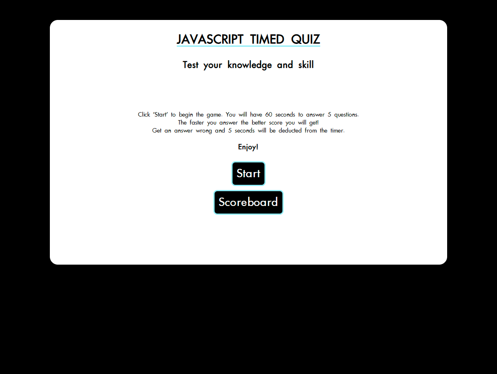

# Homework Week 3
## Javascript-Timed-Quiz

### User Story
```
AS A coding boot camp student
I WANT to take a timed quiz on JavaScript fundamentals that stores high scores
SO THAT I can gauge my progress compared to my peers
```

### Acceptance Criteria
```
GIVEN I am taking a code quiz
WHEN I click the start button
THEN a timer starts and I am presented with a question
WHEN I answer a question
THEN I am presented with another question
WHEN I answer a question incorrectly
THEN time is subtracted from the clock
WHEN all questions are answered or the timer reaches 0
THEN the game is over
WHEN the game is over
THEN I can save my initials and my score
```
### Work Description
I wrote out Sudo code in a Notepad document to help me plan out how I wanted the code to appear. I started by making the base HTML and CSS and making it say and look how I intended.

Then I started the JS where I first added questions and buttons, I then linked the button to showing the questions. Next I made the answers visible and clickable. After making each answer move to the next one I added the timer to count down once the question had been started, I added the function of removing 5 seconds from a wrong answer and stopped the clock if no questions remained. I logged the stopped clocks time and created an input for user to add initials. I logged both the stopped time and initials into the localStorage. The page then showed the scoreboard of all scores kept in localStorage. I added a clear button and button to return to the main screen. I made the scoreboard button on the main screen functional.

I had a lot of bugs to sort out within this code, by slowly going through the code I managed to fix all issues and have a fully functioning program.

>## [**Link to live GitPage**](https://lucienpep.github.io/Javascript-Timed-Quiz/)



---
Lucien Haines UADL 2022